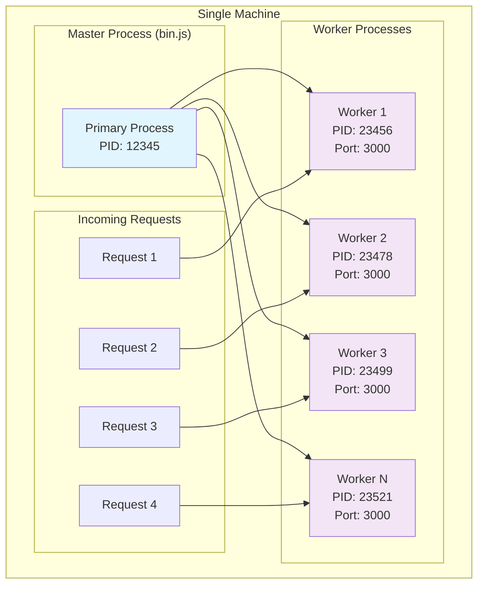
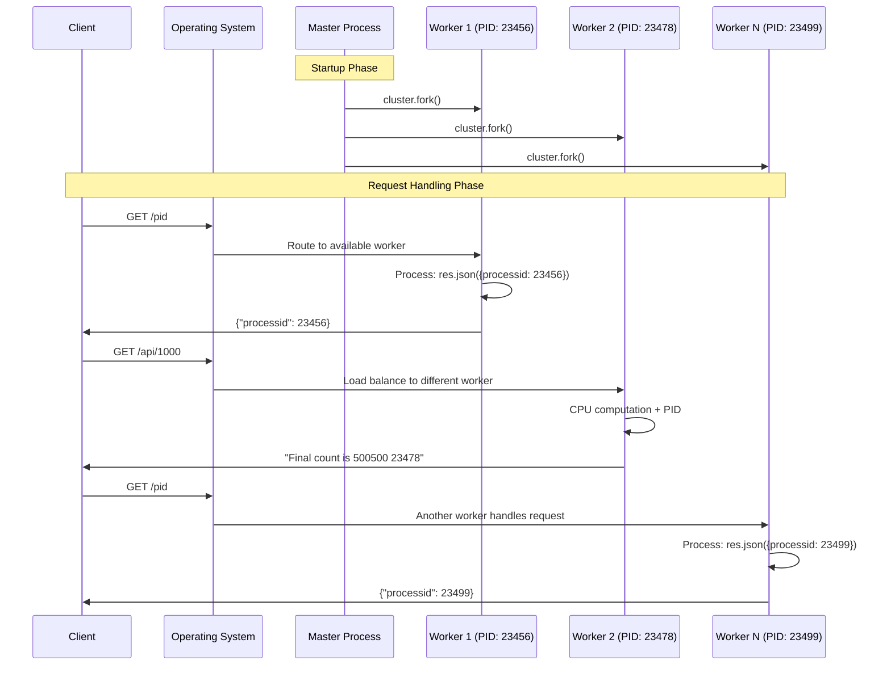

# Node.js Clustered Express Server

This project demonstrates how to run a CPU-intensive Express application across **all available CPU cores** using Node.js **Cluster API**. It provides horizontal scaling on a single machine by separating the Express application logic from the cluster management.

## 🏗️ Architecture Overview



## 📁 Project Structure

```
project/
├── index.js      # Express app with routes (application logic)
├── bin.js        # Cluster setup and worker management
├── package.json  # Project dependencies and scripts
└── README.md     # This documentation
```

## 🔧 Core Components

### 1. Express Application (`index.js`)

The Express application contains pure business logic without any clustering concerns:

```javascript
// index.js - Application Logic Only
import express from "express";

const port = 3000;

export const app = express();

app.get("/", (req, res) => {
  res.send("Hello World!");
});

app.get("/pid", (req, res) => {
  res.json({
    processid: process.pid,
  });
});

app.get("/api/:n", function (req, res) {
  let n = parseInt(req.params.n);
  let count = 0;

  if (n > 5000000000) n = 5000000000;

  for (let i = 0; i <= n; i++) {
    count += i;
  }

  res.send(`Final count is ${count} ${process.pid}`);
});
```

**Key Design Principles:**
- ✅ **ES6 Modules**: Uses modern `import`/`export` syntax instead of CommonJS
- ✅ **Named Export**: Exports `app` as a named export for better tree-shaking
- ✅ **Separation of Concerns**: Application logic is isolated from clustering
- ✅ **Reusability**: Same app instance can be used by multiple workers
- ✅ **Testability**: Easy to test without cluster complexity

**Route Analysis:**
- **`/`**: Simple "Hello World" response for basic connectivity testing
- **`/pid`**: Returns JSON with current process ID for load balancing verification
- **`/api/:n`**: CPU-intensive mathematical computation (sum from 0 to n) with process ID included in response

### 2. Cluster Management (`bin.js`)

The cluster manager handles process orchestration and load balancing:

```javascript
// bin.js - Cluster Management
import cluster from "cluster";
import os from "os";
import { app } from "./index.js";

const totalCPUs = os.cpus().length;
const port = 3000;

if (cluster.isPrimary) {
  console.log(`Number of CPUs is ${totalCPUs}`);
  console.log(`Primary ${process.pid} is running`);

  // Fork workers.
  for (let i = 0; i < totalCPUs; i++) {
    cluster.fork();
  }

  cluster.on("exit", (worker, code, signal) => {
    console.log(`worker ${worker.process.pid} died`);
    console.log("Let's fork another worker!");
    cluster.fork();
  });
} else {
  app.listen(port, () => {
    console.log(`App listening on port ${port}`);
  });
}
```

**Key Features:**
- ✅ **ES6 Modules**: Uses modern import syntax with named imports
- ✅ **Auto-scaling**: Automatically detects CPU cores and creates workers
- ✅ **Fault Tolerance**: Auto-respawns workers when they crash
- ✅ **Load Balancing**: OS-level load balancing across worker processes

## 🚀 Advanced Configurations

### Environment-Based Scaling
```javascript
// bin.js - Enhanced version
import cluster from "cluster";
import os from "os";
import { app } from "./index.js";

const totalCPUs = os.cpus().length;
const port = process.env.PORT || 3000;

// Scale based on environment
const numWorkers = process.env.NODE_ENV === 'production' 
  ? totalCPUs 
  : Math.min(2, totalCPUs); // Limit workers in development

if (cluster.isPrimary) {
  console.log(`Environment: ${process.env.NODE_ENV || 'development'}`);
  console.log(`Number of CPUs is ${totalCPUs}`);
  console.log(`Starting ${numWorkers} workers`);
  console.log(`Primary ${process.pid} is running`);

  // Fork workers
  for (let i = 0; i < numWorkers; i++) {
    cluster.fork();
  }

  cluster.on("exit", (worker, code, signal) => {
    console.log(`worker ${worker.process.pid} died (${signal || code})`);
    if (!worker.exitedAfterDisconnect) {
      console.log("Let's fork another worker!");
      cluster.fork();
    }
  });

  // Graceful shutdown
  process.on('SIGTERM', () => {
    console.log('SIGTERM received, shutting down gracefully');
    cluster.disconnect(() => {
      process.exit(0);
    });
  });

} else {
  app.listen(port, () => {
    console.log(`Worker ${process.pid} listening on port ${port}`);
  });
}
```

### Performance Monitoring
```javascript
// Add to bin.js for monitoring
cluster.on('online', (worker) => {
  console.log(`Worker ${worker.process.pid} is online`);
});

cluster.on('disconnect', (worker) => {
  console.log(`Worker ${worker.process.pid} has disconnected`);
});

// Memory usage monitoring
setInterval(() => {
  if (cluster.isPrimary) {
    const used = process.memoryUsage();
    console.log(`Primary memory usage: ${Math.round(used.rss / 1024 / 1024 * 100) / 100} MB`);
  }
}, 30000); // Every 30 seconds
```

## 🔄 Request Flow Diagram



## 🎯 Key Benefits Explained

### 1. **Multi-Core Utilization**
Your code automatically scales to use ALL available CPU cores:
- **Single Process**: Only 1 core active, others idle
- **Clustered**: All cores working simultaneously
- **Auto-Detection**: `os.cpus().length` detects available cores

### 2. **Load Distribution**
The OS kernel handles load balancing:
```javascript
// All workers listen on same port (3000)
app.listen(port, () => {
  console.log(`App listening on port ${port}`);
});
```
- Incoming requests automatically distributed
- No additional load balancer needed
- Built-in fault tolerance

### 3. **Process Isolation**
Each worker is independent:
- One worker crash doesn't affect others
- Memory leaks isolated to single process
- Easier debugging with process-specific PIDs

## ⚠️ Important Considerations

### 1. **Shared State Limitations**
```javascript
// ❌ This won't work across workers
let globalCounter = 0;
app.get('/counter', (req, res) => {
  globalCounter++; // Only increments in one worker
  res.json({ counter: globalCounter });
});
```

**Solutions:**
- Use external databases (Redis, MongoDB, PostgreSQL)
- Implement sticky sessions
- Use inter-process communication (IPC)

### 2. **Memory Usage**
```
Single Process:  ~50MB RAM
8 Workers:      ~400MB RAM (8 × 50MB)
```
Trade-off between performance and memory consumption.

### 3. **File System Limitations**
```javascript
// ❌ File locks can cause issues
app.post('/upload', (req, res) => {
  fs.writeFileSync('shared.txt', data); // Race conditions possible
});
```

## 🚀 Getting Started

### Installation
```bash
# Initialize a new project
npm init -y

# Install Express
npm install express

# Add ES6 module support to package.json
echo '{"type": "module"}' > temp.json && \
  jq -s '.[0] * .[1]' package.json temp.json > package_new.json && \
  mv package_new.json package.json && rm temp.json

# Or manually add to package.json:
# "type": "module"
```

### Package.json Configuration

Your `package.json` should include:

```json
{
  "name": "nodejs-cluster-demo",
  "version": "1.0.0",
  "type": "module",
  "main": "bin.js",
  "scripts": {
    "start": "node bin.js",
    "dev": "node index.js"
  },
  "dependencies": {
    "express": "^4.18.2"
  }
}
```

### Running the Server
```bash
# Start the clustered server (recommended)
node bin.js

# Or using npm script
npm start

# ❌ Don't run this for production (single process only)
node index.js
```

### Expected Output
```
Number of CPUs is 8
Primary 12345 is running
App listening on port 3000
App listening on port 3000
App listening on port 3000
App listening on port 3000
App listening on port 3000
App listening on port 3000
App listening on port 3000
App listening on port 3000
```

## 🧪 Testing and Verification

### API Endpoints

| Endpoint | Description | Purpose | Response Format |
|----------|-------------|---------|-----------------|
| `GET /` | Hello World message | Basic connectivity test | Plain text |
| `GET /pid` | Returns process ID | Verify load balancing | JSON object |
| `GET /api/:n` | CPU-intensive computation | Test under load | String with result and PID |

### Response Examples

```bash
# Basic connectivity
curl http://localhost:3000/
# Response: "Hello World!"

# Process ID verification
curl http://localhost:3000/pid
# Response: {"processid": 23456}

# CPU-intensive computation
curl http://localhost:3000/api/1000
# Response: "Final count is 500500 23456"
```

### Load Balancing Verification

Test the `/pid` endpoint to see different workers handling requests:

```bash
# Method 1: Multiple curl requests
for i in {1..10}; do curl http://localhost:3000/pid; done

# Method 2: Use different browsers
# Chrome: http://localhost:3000/pid
# Firefox: http://localhost:3000/pid
# Edge: http://localhost:3000/pid
```

## 🔧 Troubleshooting

### Common Issues

#### 1. **Module Resolution Errors**
```bash
# Error: Cannot use import statement outside a module
# Solution: Add "type": "module" to package.json
```

#### 2. **Port Already in Use**
```bash
# Error: EADDRINUSE :::3000
# Check what's using the port
lsof -i :3000
kill -9 <PID>
```

#### 3. **Worker Process Crashes**
```javascript
// Enhanced error handling in workers
process.on('uncaughtException', (err) => {
  console.error('Uncaught Exception:', err);
  process.exit(1); // Let cluster restart the worker
});

process.on('unhandledRejection', (reason, promise) => {
  console.error('Unhandled Rejection at:', promise, 'reason:', reason);
  process.exit(1);
});
```

### Debugging Tips

#### 1. **Process Identification**
```bash
# List all Node.js processes
ps aux | grep node

# Monitor process tree
pstree -p <master_pid>
```

#### 2. **Load Testing**
```bash
# Install Apache Bench
sudo apt-get install apache2-utils

# Test with 100 requests, 10 concurrent
ab -n 100 -c 10 http://localhost:3000/api/10000

# Results will show request distribution
```

#### 3. **Memory Monitoring**
```bash
# Monitor memory usage
top -p $(pgrep -f "node bin.js" | tr '\n' ',' | sed 's/,$//')

# Or use htop for better visualization
htop
```

## 📚 Additional Resources

### Further Reading
- [Node.js Cluster Documentation](https://nodejs.org/api/cluster.html)
- [Worker Threads vs Cluster](https://nodejs.org/api/worker_threads.html)
- [Load Balancing Strategies](https://nodejs.org/api/cluster.html#cluster_how_it_works)

### Production Deployment
- **PM2**: Advanced process manager with clustering
- **Docker**: Container-based scaling
- **Kubernetes**: Orchestrated container deployment
- **Load Balancers**: Nginx, HAProxy for multi-server setups

### Performance Tools
- **clinic.js**: Node.js performance analysis
- **autocannon**: Load testing tool
- **0x**: Flame graph profiler

## 📝 Summary

This Node.js clustering implementation demonstrates:

✅ **Modern ES6 Syntax**: Import/export modules  
✅ **Automatic Scaling**: Uses all available CPU cores  
✅ **Load Distribution**: OS-level request balancing  
✅ **Fault Tolerance**: Auto-restart crashed workers  
✅ **Process Isolation**: Independent worker processes  
✅ **Performance Verification**: PID-based testing  
✅ **Production Ready**: Error handling and monitoring  

**Key Takeaway**: By separating application logic (`index.js`) from cluster management (`bin.js`), you achieve clean architecture that scales horizontally on a single machine, maximizing CPU utilization for Node.js applications.